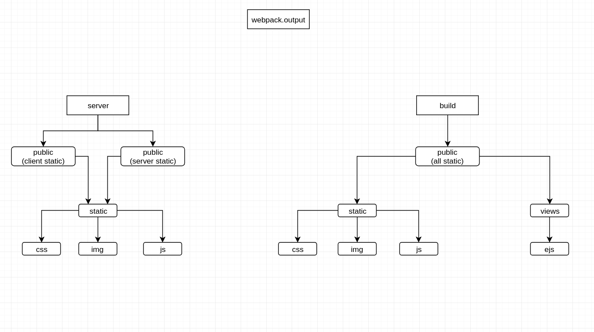

<p align="center">
  <a href="" target="_blank">
    &emsp;&emsp;
    
  </a>
</p>

# koa2 vue-cli
[](https://github.com/tnnevol/koa2-ejs-vue-cli)

## 背景
将koa2顶替 [webpack-dev-server](https://github.com/webpack/webpack-dev-server)，在开发环境中使用[webpack-dev-middleware](https://github.com/webpack/webpack-dev-middleware)把vue-cli编译好丢入内存 _这些编译后的文件可以通过http协议拿到_ koa层取到打包后的vue容器模板使用[ejs](https://ejs.bootcss.com/)编译后丢出get请求，达到dev-server的功能。本框架是笔者用于快速构建服务的脚手架，不熟练koa、vue-cli慎用！！！

## 目录结构
以实际项目为主，不一定及时更新哦
```text

├── build // webpack
├── client // 客户端
│   ├── api // 客户端api集合
│   ├── assets // 客户端文件集合
│   ├── components // 客户端vue组件
│   ├── entry // 客户端webpack入口文件
│   ├── filters // vue 过滤器
│   ├── icons // svg 文件
│   ├── router // vue-router
│   ├── store // vuex
│   ├── utils // 客户端工具
│   └── views // vue view
├── config // 全局配置文件
├── gulpfile.babel.js // gulp 任务
├── server // 服务端
│   ├── bin
│   ├── controller 
│   ├── middleware
│   ├── model
│   ├── pem
│   ├── public
│   ├── routes
│   ├── storage
│   ├── utils
│   └── views // vue 容器
└── static
```
* /server 目录是服务端开发接口和提供vue的页面容器
* /client 就是vue-cli之前的src目录
  
## webpack资源目录的架构图


## 中间件原理
对于koa的中间件的形容就是一根牙签穿透一整颗洋葱的过程，从外层进入，最后又从外层出去，牙签就是一个请求，洋葱的每一层就是中间件，请求会走过第一个中间件
_next_
前部分的代码，最后通过第一个中间件的
_next_
后部分的代码，具体可以查看[koa](https://github.com/koajs/koa/tree/master/lib)源码（大神的想法果然不一般）


## jwt 验证
jwt采用的是[jsonwebtoken](https://github.com/auth0/node-jsonwebtoken)不要问为什么，问也是不知道。jwt的中间件不是在app中验证，而是在koa-router中验证，这样可以完美的让项目返回404状态，还可以减少不必要的接口验证（明白的人明白，不明白的人我不管）。

## user的密码
对于用户的密码存储应当使用不可逆的加密，不要像笔者一样解密库中的密码进行对比，在源码中这样的操作非常危险，请谨慎！！！

## gulp
* 纯属娱乐
* [cli.js](https://github.com/nondanee/UnblockNeteaseMusic.git)，稍微修改就可以放进gulp中，冗余功能并无去除，也没时间去除。

## 更新说明
* 2020/11/02: 完成脚手架的基础搭建和文档说明
* 2020/11/03: 完成前后台的分级架构, 实现ejs的渲染中间件
* 2020/11/06: 集成element-admin
* 2020/11/10：集成文档生成、统一响应中间件、jwt验证（带有白名单）
* 2020/11/11：[apidoc](https://apidocjs.com/)的文档生成、读取项目中的.evn* 文件，设置全局的环境变量
* 2020/11/13：webpack打包结构修改、重写gulp的build任务
* 2020/11/16：抽出controller层
* 2020/11/27：servece层
* 2020/11/30：新增服务层404页面

## 待完成

## 注意
* 以防后期组件过多时编译过慢，采用接口模式和组件开发模式。接口模式不会编译任何组件，组件开始时不会重编译而是启用热更新
* 每一个model中都需要定义好主体信息，在定义接口时可以直接使用
* 项目是mvc的项目，server中的c层写在了router中，有时间再抽一下
* 项目中的中间件，可能仅仅适用于本项目，二次开发或者维护情自行了解koa中间件的封装
* 后期有时间可以研究一下vue的ssr，没时间就算了

## 维护
* 我可是靠心情维护项目的
  
## 技术
* vue-cli
* koa2
* node
* gulp
* webpack
* mongoDB